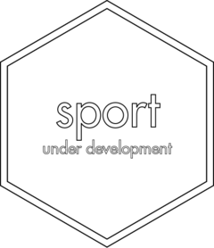

<!-- README.md is generated from README.Rmd. Please edit that file -->

# sport <a href='https://gipso.github.io/sport'></a>

<!-- badges: start -->

[](https://www.repostatus.org/#wip)
[](https://lifecycle.r-lib.org/articles/stages.html#experimental)
[](https://github.com/gipso/sport/actions)
[](https://codecov.io/gh/gipso/sport)
[](https://choosealicense.com/licenses/mit/)
<!-- badges: end -->

`sport` is an R package with the research compendium of the GIPSO’s
biological rhythms and sports systematic quantitative literature review.
The aim of `sport` is to facilitate the research work, in addition to
contributing to the reproducibility of the research.

The assemble of this package was inspired by Ben Marwick, Carl Boettiger
& Lincoln Mullen’s article [“Packaging Data Analytical Work Reproducibly
Using R (and Friends)”](https://doi.org/10.1080/00031305.2017.1375986).

Learn more about Systematic Quantitative Literature Reviews (SQLR)
[here](https://www.griffith.edu.au/griffith-sciences/school-environment-science/research/systematic-quantitative-literature-review).

## Installation

`sport` is still at the
[experimental](https://lifecycle.r-lib.org/articles/stages.html#experimental)
stage of development. That means people can use the package and provide
feedback, but it comes with no promises for long term stability.

You can install `sport` from GitHub with:

``` r
# install.packages("remotes")
remotes::install_github("gipso/sport")
```

## Citation

If you use `sport` in your research, please consider citing it. We put a
lot of work to build and maintain a free and open-source R package. You
can find the `sport` citation below.

``` r
citation("sport")
#> 
#> To cite {sport} in publications use:
#> 
#>   Poli, R. S., Vartanian, D., Pedrazzoli, M. (2021). {sport}: an R
#>   package with the research compendium of the GIPSO's biological
#>   rhythms and sports systematic quantitative literature review.
#>   Retrieved from https://gipso.github.io/sport/.
#> 
#> A BibTeX entry for LaTeX users is
#> 
#>   @Unpublished{,
#>     title = {{sport}: an R package with the research compendium of the GIPSO's biological rhythms and sports systematic quantitative literature review},
#>     author = {Rafael Salgueiro Poli and Daniel Vartanian and Mario Pedrazzoli},
#>     year = {2021},
#>     url = {https://gipso.github.io/sport/},
#>     note = {Lifecycle: experimental},
#>   }
```
